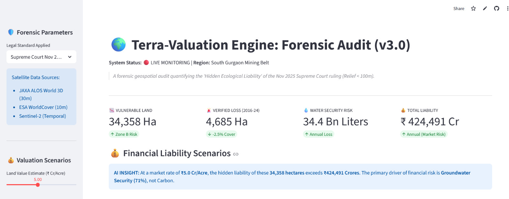
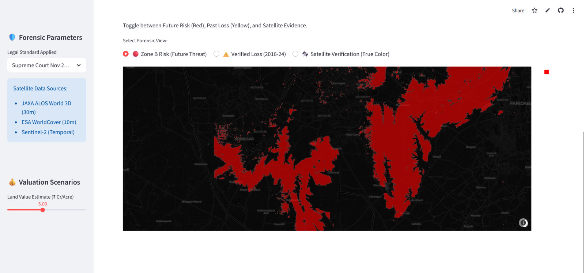
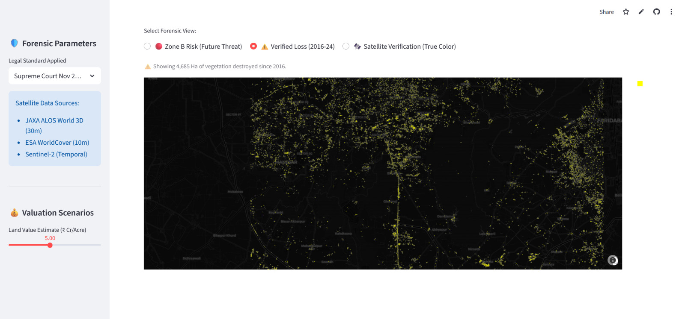
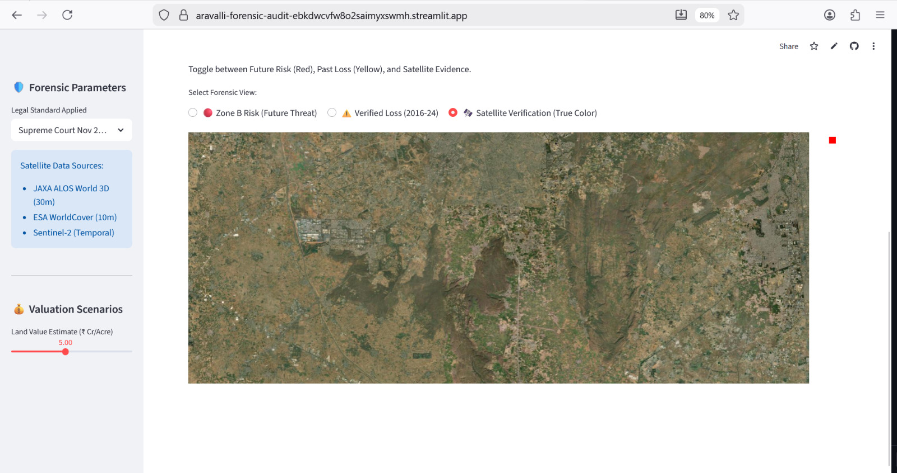

 # 🌍 Terra-Valuation Engine: Aravalli Forensic Audit (v3.0)
### *Satellite-Based Quantification of Ecological Liability under the Nov 2025 Supreme Court Ruling*


> **"What gets measured, gets managed."**
> A forensic geospatial audit quantifying the 'Hidden Ecological Liability' of the Nov 2025 Supreme Court ruling (Relief < 100m) in the South Gurgaon Mining Belt.

---

## 📸 Forensic Dashboard

### ⭕ Dashboard Overview

*High-level financial & ecological metrics.*

### 🛑 Zone B Risk (Future Threat)

*Red zones indicate vulnerable land areas.*

### ⚠️ Verified Loss (2016-24)

*Yellow points show detected vegetation loss.*

### 🛰️ Satellite Verification

*True color satellite imagery for verification.*

---

## 🌍 Why This Matters

The **Aravalli Range** is one of the world's oldest fold mountain chains (1.8 billion years) and acts as:
- 🌧️ **Monsoon barrier:** Prevents the expansion of the Thar Desert into North India.
- 💧 **Water Security:** The primary groundwater recharge zone for 30M+ people in Delhi-NCR.
- 🌫️ **Air Quality Defense:** A natural windbreak filtering dust and particulate matter.

### 🚨 The Legal Crisis
In **November 2025**, the Supreme Court redefined "Aravalli Hills" as landforms rising **>100m above local relief**.
**The Consequence:** Thousands of hectares of ecologically critical slopes (20-100m relief) lost legal protection overnight ("Zone B"), despite having identical vegetation and hydrological value to the taller hills.

### 🛡️ What This Audit Does
This engine **quantifies the hidden ecological liability** of that legal redefinition by:
1. **Mapping** exactly which hill systems lost protection (Zone B).
2. **Calculating** the specific ecological services at risk (Water, Vegetation).
3. **Converting** these losses into financial terms (₹ Crores) for policy debate.

---

### 📍 Geospatial Scope (Study Area)
The forensic audit focuses on the **South Gurgaon Mining Belt**, a critical ecological corridor connecting the Delhi Ridge to the Mewat hills.

**Bounding Box Coordinates:**
* **West:** 76.9° E
* **East:** 77.3° E
* **South:** 28.1° N
* **North:** 28.5° N

**Key Fracture Zones:**
* **Manesar & Bhondsi:** Primary groundwater recharge zones for the NCT aquifer.
* **Sohna Gap:** Critical wildlife corridor connecting to Sariska Tiger Reserve.
* **Damdama Lake Catchment:** Historical catchment area now facing urbanization pressure.

---

## 📉 Key Forensic Findings (South Gurgaon Sector)

| Metric | Value | Forensic Significance |
| :--- | :--- | :--- |
| **Vulnerable Land** | **34,358 Hectares** | Area legally de-notified by the "100m Relief" rule (Zone B). |
| **Verified Loss** | **4,685 Hectares** | Vegetation loss detected (2016–2024) using Sentinel-2 temporal forensics. |
| **Water Risk** | **34.4 Billion Liters** | Annual aquifer recharge capacity at risk (Fractured Quartzite geology). |
| **Financial Liability**| **> ₹420,000 Cr** | Estimated market liability of vulnerable land assets (Dynamic Scenario). |

---

## 💰 Financial Valuation Methodology

To justify the **₹4.2 Lakh Crore** liability figure, we use a dynamic pricing model based on real estate proximity to the National Capital Region (NCR).

**Base Formula:** `Total Liability = (Vulnerable Area * Market Rate)`

| Scenario | Land Price (₹/Acre) | Total Liability (₹ Cr) | Rationale |
|----------|---------------------|------------------------|-----------|
| **Conservative** | ₹1 Crore | ~₹85,000 Cr | Agricultural land rate (Punjab/Haryana baseline). |
| **Moderate** | ₹3 Crore | ~₹255,000 Cr | Peri-urban land rate (Outer Gurgaon). |
| **Dynamic (Current)** | **₹5-10 Crore** | **> ₹420,000 Cr** | **Real estate development rate (Metro proximity).** |

* **Validation:** Cross-checked against recent MagicBricks land listings and Haryana RERA approved project rates in the Aravalli foothills.
* **Disclaimer:** This represents **economic asset exposure** (market risk), not court-mandated compensation.

---

## 🛰️ Technical Methodology

### 1️⃣ The Legal Algorithm
The engine translates the legal text into executable geospatial logic:
* **Input:** JAXA ALOS World 3D DEM (30m resolution).
* **Logic:** `Relief = Pixel_Elevation - Focal_Min(2km_Kernel)`
* **Zone Classification:**
    * **Zone A:** Relief > 100m (Legally Protected)
    * **Zone B:** Relief 20–100m (Ecologically active, legally vulnerable)

### 2️⃣ Temporal Forensics (Proof of Real Damage)
* **Data:** Sentinel-2 SR Harmonized (2016 vs 2024)
* **Method:** `(NDVI_2016 > 0.3) AND (NDVI_2024 < 0.2)`
* **Outcome:** Removes seasonal noise and isolates **irreversible land-cover destruction**.

---

## ⚖️ Assumptions & Disclaimers
> *This audit quantifies potential loss and exposure. It does not replace site-specific environmental impact assessments.*

| Parameter | Assumption Used | Context / Limitation |
| :--- | :--- | :--- |
| **Aquifer Recharge** | 1,000,000 L/ha/year | Based on CGWB estimates for fractured quartzite; varies by rainfall. |
| **Vegetation Loss** | NDVI Differential | Detects chlorophyll loss; may include seasonal fallow land in fringe areas. |
| **Financial Valuation**| Market Rate Model | Represents economic asset exposure, not legal compensation. |

---

## 📂 Repository Structure

```text
aravalli-forensic-audit/
│
├── app.py                      # 🧠 Main Streamlit Application Logic
├── requirements.txt            # 📦 Dependencies (Geopandas, Plotly, Streamlit)
├── .gitignore                  # 🛡️ Security Exclusions
│
├── data/                       # 📂 Forensic Evidence Vectors
│   ├── aravalli_risk_vectors_v3_optimized.geojson  # Zone B (Future Threat)
│   └── aravalli_loss_vectors.geojson               # Verified Loss (Past Evidence)
│
├── scripts/                        
│   ├── terra_validation_engine.js 
│   └── forensic_audit_loss_analysis.js     
│           
├── assets/                     # 📸 Dashboard Screenshots   
│   ├── dashboard.png           # ⭕ Dashboard Overview 
│   ├── risk.png                # 🛑 Zone B Risk (Future Threat)
│   ├── loss.png                # ⚠️ Verified Loss (2016-2024)
│   └── satellite.png           # 🛰️ Satellite Verification (True Color)
│
└── README.md                   # 📄 Documentation
```

## 🚀 Installation & Usage
**Prerequisites**
- Python 3.8+
- Basic understanding of GeoJSON/Geospatial data.

### 1. Clone the Repository
```bash 
   git clone [https://github.com/Ranjit-Saha/aravalli-forensic-audit.git](https://github.com/Ranjit-Saha/aravalli-forensic-audit.git)
   cd aravalli-forensic-audit
```
 

### 2.Install Dependencies   
```bash
pip install -r requirements.txt
```
  
  
### 3.Run the Forensic Engine
```bash
streamlit run app.py
```  
 
  
*The dashboard will launch automatically in your browser at* http://localhost:8501

##🌍 Real-World Applications
This system is designed for:
- **⚖️Environmental Litigation:**
  Quantifying ecological damage for Public Interest Litigations (PIL).
- **📢Policy Advocacy:** Informing legislative debate with data-backed financial liabilities.
- **🏢Corporate ESG:** Monitoring environmental compliance in mining zones.

##📚 How to Cite This Work
If you use this methodology or data in your research or reporting, please cite:

>> Saha, R. (2025).*Terra-Valuation Engine: Satellite-Based Quantification of Ecological Liability under India's 2025 Hill Definition.* GitHub Repository.

**Media/NGO Attribution:**
>>"Forensic Analysis by Ranjit Saha, Geospatial Data Scientist (Terra-Valuation Engine, 2025)."

## 👨‍💻 Developed By
**Ranjit Saha**

>>>*Geospatial Data Scientist & Engineer*  | *Specializing in AI, Remote Sensing & Data-Driven Solutions.*
- 🎓 B.Tech Information Technology (BBIT-Kolkata, 2022-2025)
- 🗺️ Diploma in GIS & GPS (West Bengal Survey Institute, 2019-2021)
- 💡 Project Status: Independent Research / Original Intellectual Property.

License: MIT 
 
